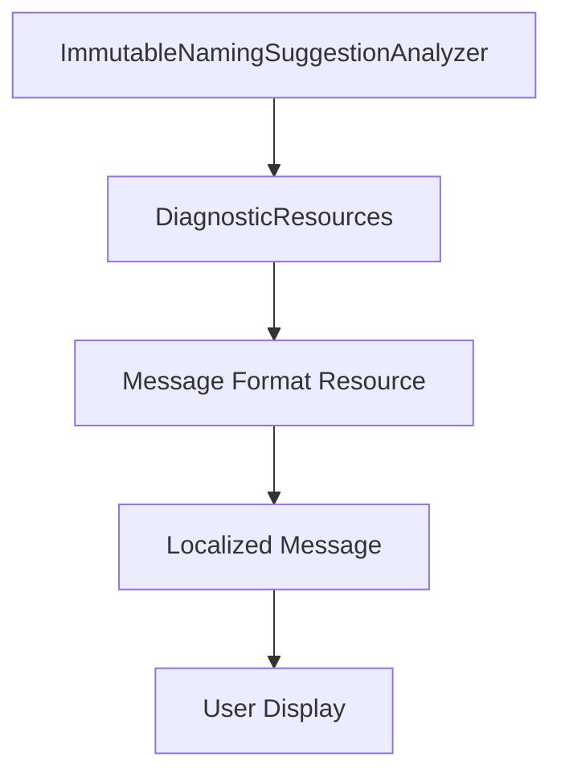

# Technical Design

---

**Purpose**: Fix incorrect error message in LVP0003 diagnostic by using correct resource string.

**Approach**:
- Modify existing analyzer code to use LVP0003_MessageFormat instead of LVP0001_MessageFormat
- Minimal, surgical fix with low risk

**Warning**: Design is concise because this is a simple bug fix to existing code.

---

## Overview

This feature fixes a bug where the LVP0003 diagnostic (suggesting underscore naming for effectively immutable variables) displays the wrong error message. The analyzer is currently using the LVP0001 message format ("Cannot reassign a value to immutable local variable") instead of the correct LVP0003 message ("Local variable is effectively immutable. Consider starting its name with an underscore").

**Users**: C# developers using PureSharp analyzers

**Impact**: Fixes incorrect user-facing error messages, ensuring users receive the correct guidance for naming convention enforcement.

---

### Goals
- Fix the resource string lookup bug in ImmutableNamingSuggestionAnalyzer
- Ensure LVP0003 displays the correct message in all supported languages
- Maintain backward compatibility with existing analyzer behavior

### Non Goals
- Changing the analyzer's detection logic
- Adding new diagnostics or features
- Modifying existing error codes beyond this fix

---

## Boundary Commitments

### This Spec Owns
- The ImmutableNamingSuggestionAnalyzer code path for LVP0003
- Resource string references for LVP0003 in the analyzer
- Tests for the LVP0003 diagnostic message format

### Out of Boundary
- Detection logic for identifying effectively immutable variables
- Other LVP0001 and LVP0002 diagnostics
- Resource file contents (except verifying LVP0003 is correct)
- Analyzer initialization and integration

### Allowed Dependencies
- Microsoft.CodeAnalysis.* namespaces (existing dependencies)
- DiagnosticResources resource strings (existing infrastructure)

### Revalidation Triggers
- Changes to LVP0003 message content in resource files
- Changes to the analyzer's variable detection logic

---

## Architecture

### Existing Architecture Analysis

The PureSharp analyzer is a Roslyn-based diagnostic analyzer that provides static analysis warnings for C# code.

Current architecture:
- Analyzer: `ImmutableNamingSuggestionAnalyzer` - Detects variables never reassigned
- Resources: `DiagnosticResources.cs` and `.resx` files - Localizable message strings
- Tests: `ImmutableNamingSuggestionAnalyzerTests.cs` - Unit and integration tests

The analyzer correctly identifies variables (0 reassignment count) and reports them, but uses the wrong message format resource.

### Architecture Pattern & Boundary Map



**Architecture Integration**:
- Selected pattern: DiagnosticAnalyzer with resource-based localization
- Domain boundaries: Analyzer logic (unchanged) vs. Message display (bug fix)
- Existing patterns preserved: Resource-based localization, LVP0001/LVP0002 for different rules
- New components rationale: None - this is a bug fix to existing component
- Steering compliance: Follows existing Roslyn analyzer patterns

### Technology Stack

| Layer | Choice | Role in Feature | Notes |
|-------|--------|-----------------|-------|
| Analyzer | Microsoft.CodeAnalysis.Diagnostics | Reports LVP0003 diagnostic | Existing Roslyn analyzer |
| Resources | System.Resources (ResourceManager) | Localizes error messages | Already in use |
| Testing | xUnit | Verifies message format | Existing test infrastructure |

---

## File Structure Plan

### Directory Structure

```
src/
└── PureSharp.Core/
    ├── ImmutableNamingSuggestionAnalyzer.cs  # Modified: Fix resource lookup
    └── Resources/
        ├── DiagnosticResources.cs            # Reference only
        └── DiagnosticResources.ja.resx        # Reference only (verify LVP0003)
```

### Modified Files

- `/home/loach/project/PureSharp/src/PureSharp.Core/ImmutableNamingSuggestionAnalyzer.cs`
  - **Change**: Line 21 - Change `LVP0001_MessageFormat` to `LVP0003_MessageFormat`
  - **Reason**: Use correct resource string for LVP0003 diagnostic
  - **Impact**: LVP0003 will display "Local variable '{0}' is effectively immutable..." instead of "Cannot reassign a value..."

---

## System Flows

Skip - This is a simple code change with no complex flows.

---

## Requirements Traceability

| Requirement | Summary | Components | Interfaces | Flows |
|-------------|---------|------------|------------|-------|
| 1.1 | LVP0003 shows correct message format | ImmutableNamingSuggestionAnalyzer | Diagnostic.Create | N/A |
| 1.2 | Japanese message displays correctly | ImmutableNamingSuggestionAnalyzer | LocalizableResourceString | N/A |
| 1.3 | English message displays correctly | ImmutableNamingSuggestionAnalyzer | LocalizableResourceString | N/A |
| 2.1 | Error output consistent with other diagnostics | ImmutableNamingSuggestionAnalyzer | Diagnostic.Create | N/A |
| 3.1 | Variable name substituted in message | ImmutableNamingSuggestionAnalyzer | Diagnostic.Create | N/A |
| 4.1 | Message works with any variable name | ImmutableNamingSuggestionAnalyzer | Diagnostic.Create | N/A |
| 5.1 | User understands suggestion to use _ | ImmutableNamingSuggestionAnalyzer | Diagnostic.Create | N/A |

---

## Components and Interfaces

### PureSharp Analyzer

| Field | Detail |
|-------|--------|
| Intent | Detects variables never reassigned and suggests underscore naming |
| Requirements | 1.1, 1.2, 1.3, 2.1, 3.1, 4.1, 5.1 |
| Owner / Reviewers | Analyzer team |

**Responsibilities & Constraints**
- Detects variables with zero reassignment count
- Excludes catch clauses, using statements, foreach loop variables
- Ignores variables already starting with underscore
- Reports LVP0003 diagnostic with correct message format

**Dependencies**
- Inbound: Microsoft.CodeAnalysis.* - Roslyn analysis API (P0)
- Outbound: DiagnosticResources resource strings (P0)
- External: System.Resources - Resource localization (P0)

**Contracts**: Service [ ] / API [ ] / Event [ ] / Batch [ ] / State [ ]

##### Implementation Notes
- **Integration**: No integration changes; single line modification
- **Validation**: Update tests to verify correct message format in multiple languages
- **Risks**: Low - surgical change with well-defined scope

---

## Data Models

N/A - This is a code fix with no data model changes.

---

## Error Handling

N/A - This feature fixes existing error reporting behavior.

---

## Testing Strategy

### Unit Tests
- **ImmutableNamingSuggestionAnalyzerTests.LVP0003_Descriptor_HasCorrectId** - Verify LVP0003 descriptor exists
- **ImmutableNamingSuggestionAnalyzerTests.LVP0003_Descriptor_IsWarning** - Verify diagnostic severity
- **ImmutableNamingSuggestionAnalyzerTests.LVP0003_Descriptor_IsEnabledByDefault** - Verify default enabled state
- **ImmutableNamingSuggestionAnalyzerTests.ImmutableVariable_WithoutUnderscore_ReportsLVP0003** - Verify diagnostic is reported
- **New Test**: Verify LVP0003 displays correct message format (Japanese and English)

### Integration Tests
- Build and test with various C# code snippets to ensure correct message appears

### Verification
- Run tests to ensure no regressions
- Verify message appears correctly in IDE diagnostics output

---

## Optional Sections

N/A - Not applicable for this simple fix.
